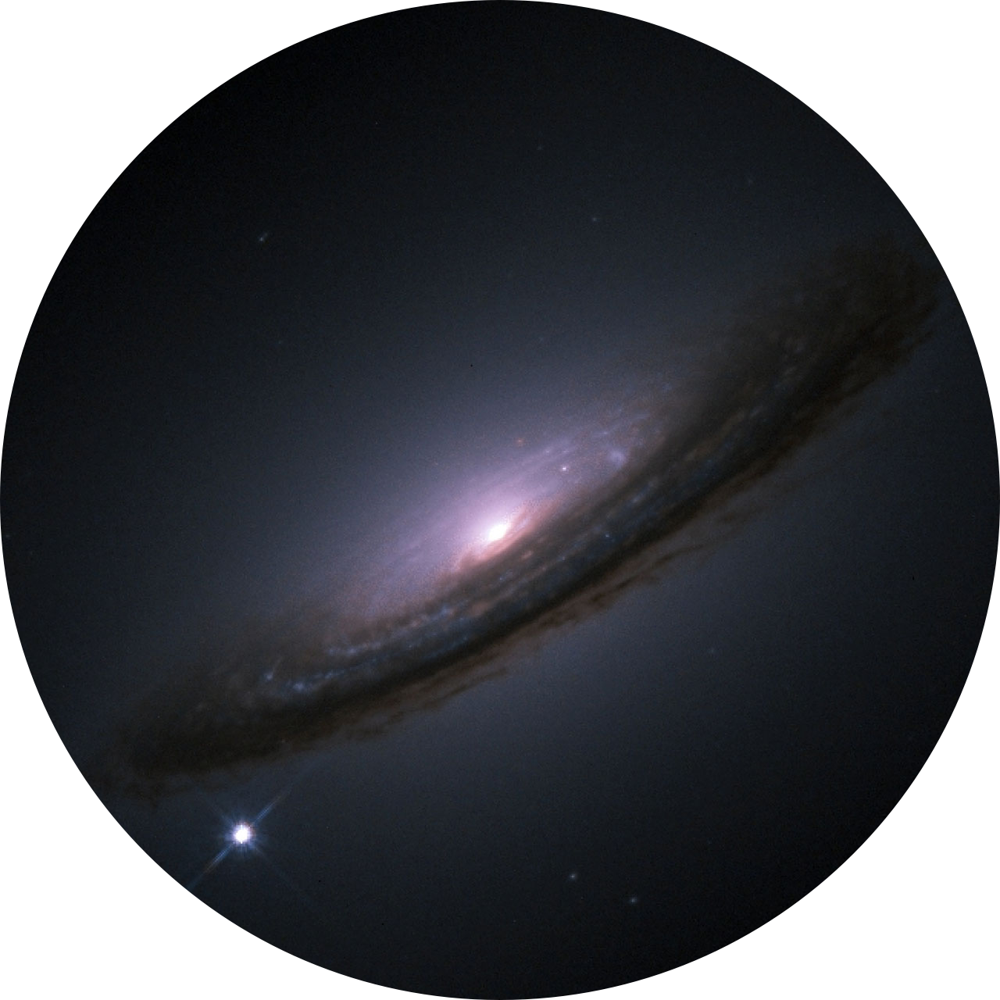

Читаю учебники и книги по высшей математике за тебя, за него, за неё, за них, и пишу рецензию после прочтения, если было годно.

В школе и универе вы не могли понять математику и физику потому что не было возможности сконцентироваться из-за обилия преподаваемых предметов. Если сосредоточиться на физмате по предлагаемым книгам, то он обязательно попрёт.

--------------------

# ИНТЕРЕСНЫЕ ФАКТЫ И ЗАМЕТКИ
- Слово «программирование» в словосочетании «математическое программирование» надо понимать как «планирование». Путаница пошла из-за кальки с английского, ибо там programming это и есть планирование.
- *хуй да нихуя, хрен да маленько, от хуя уши* - бесконечно малая величина
- бесконечно малая это обратная бесконечно большой
- соответствия между словосочетаниями в старой советской литературе и новой
	- положим -> пусть
- (18 окт 24) После прочтения половины книг из серии «Популярные лекции по математике» начинаю понимать, что в учебниках проебалась романтика, которая была 1950-х. Тогда в учебниках были алгоритмы нахождения корня любого числа, а в нулевых их было уже не сыскать. Также логарифмы в наше время объясняли слишком быстро, не вдаваясь в исторические детали. Но с другой стороны, это всё не нужно, когда есть калькуляторы. Но логарифмы ведь и создавались для того, чтобы умножение и деление превратить в сложение и вычитение, а возведение в степень и извлечение корня превратить в умножение и деление, дабы облегчить себе вычисления. Поэтому нам это не рассказывали в нулевых, потому что мы жертвы калькуляторов.
- *Теория геодезических линий изучается в курсах высшей математики - Теории поверхностей и Вариационном исчислении*
- **МАТЕМАТИКА ДЛЯ КОМПЬЮТЕРНОЙ ГРАФИКИ** [Какие резделы высшей математики потребуются для компьютерной графики? (Английский)](MATH_FOR_COMPUTER_GRAPHICS.md)

# ЭЛЕМЕНТАРНАЯ (ШКОЛЬНАЯ) МАТЕМАТИКА
- **Киселев «Краткая алгебра для женских гимназий и духовных семинарий»**
- **Киселёв «Систематический курс арифметики»**
- **Киселёв «Элементарная алгебра»**
- **Киселёв «Элементарная геометрия»**
- **Сканави «Элементарная математика»**
- **Крамор «Повторяем и систематизируем школьный курс алгебры и начал анализа»**
- **Крамор «Повторяем и систематизируем школьный курс геометрии»**
- **5ти-томник «Энциклопедия элементарной математики»**

# ИСТОРИЯ И ФИЛОСОФИЯ МАТЕМАТИКИ И ФИЗИКИ
- **Костенко «Коренная проблема втузовского учебника математики»**
	- *Краткая версия книги того же автора «Проблема качества математического образования в свете исторической ретроспективы»*
	- *Академик А. Н. Крылов, знаменитый кораблестроитель, математик и педагог бил тревогу: В преподавании математики начинает выступать на первый план чисто логическое умозрение в ущерб наглядности и прикладной стороне дела.. такой характер преподавания.. в технических школах... противоестественен, ибо он не соответствует ни склонностям и направлению ума слушателей, ни цели учебного заведения. Возражал А. Н. Крылов против схоластической идеи повышения строгости изложения математики. Для инженера ... такая всеобъемлющая строгость является бесцельной. На инженера эти строгие, лишённые наглядности доказательства и рассуждения наводят тоску и уныние, он видит в них топтание на месте, жевание жвачки, стремление доказать очевидное, что давно им понятно и что ему до доказательства кажется более ясным и понятным, нежели после доказательства.*
- **Моррис Клайн, статья «Логика против педагогики»**
	- *PDF-файл статьи легко найти в яндексе по запросу «M. Kline (1970) "Logic versus pedagogy"», дополнительно он представлен в этом репозитории в папке `articles`*
	- *Базированная база. Действительно, подавать материал через логику, а не через интуицию - это самый наипростейший путь для лектора, не на надо ничего объяснять, можно просто пробубнить/прочитать лекции.*
	- *По моему мнению, усложнённый научный язык в учебниках и пособиях по математике должен быть только в аспирантуре, а не в школе и не при получении высшего образования первый раз.*
- **Прасолов «История математики»**
	- *«История математики — важная часть математического образования. Полезно знать и понимать не только сами математические понятия, но и то, как они возникли и как развивались. В этой книге описана прежде всего история возникновения и развития математических идей и понятий. Знаменитые сейчас теоремы нередко открывались для весьма неожиданных узких целей и лишь потом находили более широкое применение. Для понимания истории математики необходимо также иметь некоторое представление о биографиях математиков»* 
	- *История математики до 19 века включительно. Стоит прочитать, чтобы понимать как становилась математика. В книге упоминаются названия мемуаров и трудов на латинском, французском, немецком и итальянском языках, которые легко можно найти в поисковиках*
- **Костенко «Проблема качества математического образования в свете исторической ретроспективы»**
	- https://www.mathedu.ru/text/kostenko_problema_kachestva_matobrazovaniya_2013/p0/
	- *Выявлена динамика изменения качества отечественного математического образования, начиная с 1920-х гг. Сделаны сравнительные количественные оценки. Определены периоды роста, моменты и периоды падения качества знаний абитуриентов. Подробно исследованы реформы 1960-70-х гг. в начальной, средней, высшей педагогической и высшей технической школах: выявлены истоки и генезис их идей, методы реализации, конкретизированы результаты реформ. Установлена связь падения качества знаний с идеями реформ. Проанализирована идеология реформ, сформулированы её основные постулаты и показано, что они противоречат классическим законам дидактики и методики. Книга предназначена для научных работников, аспирантов и студентов педагогических специальностей, учителей, преподавателей методики математики, преподавателей вузов и вообще для всех, кому небезразлична судьба российского образования.*
	- *Внезапно для себя выяснил, что в 1920-х школа была угроблена экспериментами людей, которые хотели строить новый мир. Уже в следующем десятилетии, в 1930-х, школу пришлось восстанавливать до дореволюционного состояния, чтобы восстановить успеваемость и дать инженеров для производства. Наглядно видно, что не большевики сделали школу, а те учителя и методисты, которые остались на работе со времён РИ. Изначально хорошее качество советской школы оказывается определялось тем, что в русской культуре ещё при царе созрели отличные педагоги и проверенные временем методики обучения. Всему хорошему в школе мы обязаны не левым идеям, а русской педагогической культуре. Левым идеям здесь принадлежит только всеобуч, который реальным спросом у молодёжи не пользуется.*
- **Клайн «Математика. Утрата определённости»**
	- *Эта книга о глубоких изменениях, которые претерпели взгляды человека на природу и роль математики. Ныне мы знаем, что математика не обладает теми качествами, которые некогда снискали ей всеобщее уважение и восхищение. Наши предшественники видели в математике непревзойдённый образец строгих рассуждений, свод незыблемых «истин в себе» и истин о законах природы. Главная тема этой книги — рассказ о том, как человек пришёл к осознанию ложности подобных представлений и к современному пониманию природы и роли математики.*
	- *Читать книгу всем и обязательно. Для меня стало открытием, что доказательства в математике являются лишь в конце исследовательской работы, они только скрепляют знания, но не являются методом получения этих знаний и открытий как таковых.*
- **Апокин, Майстров. «История вычислительной техники»**
	- *При чтении наконец дошло, что логарифмы были специально созданы для того, чтобы свести умножение к сложению, и тогда сложение в данном случае выполнилось бы только один раз.*
	- *Читал у Пулькина в «Вычислительной математике» о конечных разностях разного порядка. С помощью них проверялись табуляции. В описываемой книге эти разности разного порядка использовались для табуляции многочленов с помощью разностной машины Бэббиджа.*
 - **Фетисов «О доказательствах в геометрии»**
      - *Маленькая книжка написана для того, чтобы помочь учащимся разобраться в следующих вопросах: что такое доказательство? зачем нужно доказательство? каким должно быть доказательство? что можно в геометрии принимать без доказательства?*
      - *Ссылаются на неполные доказательства в учебниках Киселёва*
      - *Абзац из брошюры: итак, анализ и синтез - две неразрывно связанные между собой стадии одного и того же процесса - построения доказательства данной теоремы. Анализ - метод отыскания доказательства, синтез - метод изложения доказательства. Умениед елать анализ и самостоятельно находить доказательства приобретается путём многократных упражнений, для чего необходимо систематически решать задачи на доказательство.*
      - *Понятия полноты системы аксиом объясняется через оригинальную аналогию на примере системы уравнений*
      - *Рекомендуется литература для более основательного ознакомления с вопросом о математическом доказательстве*
        - общие руководства по логике
          - Строгович. Логика
          - Асмус. Логика.
          - Таванец. Суждение и его виды
        - вопрос об основных предположениях и системе аксиом геометрии, а также о доказательстве освещён в книгах
          - Адамар. Элементарная геометрия. Вопрос о доказательстве разобран в «Прибавлении»
          - Гильберт. Основание геометрии. Вопрос о сущности аксиоматического метода рассматривается в вводной статье Рашевского 
          - Дубнов. Ошибки в геометрических доказательствах. В книге приведено много примеров ошибочных доказательств и разобраных различные ошибки.
          - Градштейн. Прямая и обратная теоремы. Книга посвящена вопрос о соотношениях между прямой и обратной теоремами
        - сборники упражнений и задач, содержащие задачи на доказательство:
          - Много интересных задач на доказательство содержится в уже упомянутом курсе геометрии Адамара. Задачи снабжены подробными решениями профессора Перепёлкина.
          - Шклярский, Ченцов, Яглом. Избранные задачи и теоремы элеметраной математики. Часть 2. Геометрия.
          - Дынкин, Успенский. Математические беседы
          - Делоне, Житомирский. Задачник по геометрии
          - Делоны, Житомирский, Фетисов. Сборник геометрических задач
- **Головина, Яглом «Индукция в геометрии»**
	- *Продолжение книжки Соминского «Метод математической индукции»*
	- *Прочитал по диагонали, но надо бы с этим основательно ознакомиться поздней* 
	- *Рекомендуются книги Яглом и Яглом. Неэлементарные задачи в элементарном изложении; Дынкин, Успенский. Математические беседы (Библиотека математического кружка);
	Шклярский, Ченцов, Яглом. Избранные задачи теоремы элементарной математики (Библиотека математического кружка)*
- **Бруснецов и Троичная логика**
	- **Брусенцов Н П ЭВМ СЕТУНЬ История создания** https://www.youtube.com/watch?v=IO4-YwhyvrM
		- в процессе ококло 50:00 или чуть дальше обсуждается учебник Киселёва с позиции философии и в положительном тоне
		- упоминаются факты из истории развития математики, силлогизм
	- **Николай Петрович Брусенцов о своём обобщении традиционной логики** https://www.youtube.com/watch?v=23xWMOZUYSM
		- филофские темы насчёт троичной и двоичной логики
- **Каганов, Любарский. Абстракция в математике и физике**
	-
	- ___в процессе___
	-

# АНАЛИТИЧЕСКАЯ ГЕОМЕТРИЯ
- **Маркушевич «Замечательные кривые»**
	- *В конце рекомендуется дополнительная литература, в том числе о циклоиде. Сойдёт как введение в ангем для зелени и школоты.*
- **Смогоржевский «Метод координат»**
	- *Наконец увидел как была получена формула окружности (через расстояние между центром и точкой на окружности)*
	- *Рассматриваются прямоугольные декартовы и полярные системы координат*
	- *Очень интересный 9й параграф, где фигуры определяют уравнениями*

# ПРОЕКТИВНАЯ ГЕОМЕТРИЯ
- С проективной геометрией я встречался когда изучал 3D и матрицы. Спустя 10 лет пора уже изучать теорию этого раздела
- **Аргунов, Скорняков «Конфигурационные теоремы»**
	- *Приступая к чтению книги понятия не имею что это за дичь, впервые о ней слышу.*
	- *Из аннотации: в лекции изложены важнейшие конфигурационные теоремы на плоскости и их применение к решению некоторых практических задач. У читателя предполагаются лишь самые элементарные знания по планиметрии и стереометрии. Необходимые сведения о центральной проекции и несобственных элементах пространства приводятся в самой лекции. Лекция будет полезной не только для школьного математического кружка, но и для топографа и геодезиста.*
	- *Конфигурационные теоремы успешно применяются к изучению свойств многоугольников и к решению задач. Они особенно полезны при решении задач на построение в условиях различных ограничений: при построениях только с линейкой, при построениях на ограниченной части плоскости, при построяениях с недоступными точками и т.п.*
	- *Некоторые конфигурационные теоремы были известны ещё древним. В новое время оин составили основу одно из интереснейших ветвей геометрии - проективной геометрии. Проективная геометрия в свою очередь представляет теоретическую базу учения об изображении пространственных фигур на плоскости - начертательной геометрии.*
	- *Книжка действительно представила приложение теории к прикладным задачам, это круто*
	- *Рекомендуется литература*
	    - Аргунов. Конфигурационные постулаты и их алгебраические эквиваленты
	    - Гильберт, Кон-Фоссен. Наглядная геометрия
	    - Курант, Роббинс. Что такое математика
	    - Скорняков. Проективные плоскости
	    - Цюльке. Геометрические построения на ограниченном куске плоскости
	    - Четверухин. Проективная геометрия
	    - Pickert G. Projektive Ebenen
- **Смогоржевский «Линейка в геометрических построениях»**
    - *В книжке рассматриваются задачи на построение, решаемые при помощи одной только линейки или с использованием также какой-либо вспомогательной фигуры. В связи с этим рассматриваются некоторые основные понятия проективной геометрии. Книжка рассчитана на школьников старших классов, студентов младших курсов пединститутов и универститеов и преподавателей математики.*
    - *В изложении авторы придерживались методов синтетической геометрии, т.е. избегали применения приёмов, характерных для арифметики и алгебры. Лишь в некоторых из начальных параграфов допущены незначительные отклонения от этого принципа, вызванные желанием упростить изложение. По мнению авторов. доказательства теорем и решения задач, основанные на применении методов синтетической геометрии, неред отличаются большим изяществом и оригинальностью.*
    - *По ходу затрагиваются конические сечения.*
    - *Врядли мне такое пригодится, но всё же это всё о проективной геометрии.*

# ТЕОРИЯ ИГР
- **Вентцель «Элементы теории игр»**
	- *Книга представляет собой поплуярное изложение элементов теории игр и некоторых способов решения матричных игр. Она почти не содержит доказательств и иллюстрирует основные положения теории примерами. Для чтения достаточно знакомства с элементами теории вероятностей и математического анализа. Книга предназначена для популяризации идей теори игр, имеющей широкое практическое применение в экономике и военном деле.*

# АЛГЕБРА, ТЕОРИЯ ЧИСЕЛ
- **Шафаревич «О решениях уравнений высших степеней (метод Штурма)»**
	- *Когда читал книгу по вычислительной математике, то задался вопросом, как узнать количество корней многочлена и вычислить эти корни? В книге описан метод Штурма, который как раз помогает выяснить это. Но, кажись, это не для всех уравнений. В основе деление многочлена на производный от него многочлен (используется понятие производной)*
- **Курош «Алгебраические уравнения произвольных степеней»**
	- *Вскользь упоминаются поля, группы, кольца. Не обошлось без комплексных чисел, само собой. Надо бы будет перечитать.*
	- *В конце даётся литература для дальнейшего изучения высшей алгебры, и как я понял, эта литература не должна быть сложной.*
- **Гельфонд «Решение уравнений в целых числах»**
	- *Из введения: решение уравнений в целых числах имеет не только теоретических интерес. Такие уравнения иногда встречюатся в физике. Теоретический интерес уравнений в целых числах достаточно велик, так как эти уравнения тесно связаны с многими проблемами теории чисел.*
	- *В решениях используются цепные дроби, упоминаются пифагоровы треугольники, теорема Ферма и метод спуска*
	- *Прочитал по диагонали не вникая. В 2025м надо будет перечитать*
- **Воробьев «Числа Фибоначчи»**
	- *Снова вспомнил, что числа Фибоначчи можно вывести и по формуле от n*
	- *Рассказывается о том, что существует такая запись числа как фибоначчиевая*
	- *Приводится определение сравнения по модулю числа*
	- *Играются с непрерывными дробями, рекомендуют почитать книгу Хинчина «Цепные дроби»*
	- *Упоминается золотое сечение, которое я предвкушал, потому как частично знаком с темой*
	- *Последний 5й параграф очень интересный. В нём рассказывается о теории поиска минимального/максимального значения функции, которая не задана аналитически. Я думал, что эта книга окажется малополезной, но этот параграф прямо затащил. ЧСХ, я догадался об оптимальном способе поиска до того, как автор представил его, потому что уже знал про бинарный поиск из курса алгоритмов и структур данных.*
	- *Книга в целом классная, надо будет перечитать и повторить выкладки, когда найдётся свободное время*
	- *Рекомендуются книги Арнольда «Теория чисел», Гельфонда «Приближения алгебраических чисел алгебраическими же числами и теория трансцендетных чисел» и Кудрявцева «Суммирование степеней чисел натурального ряда и числа Бернулли»*
- **Болтянский «Равновеликие и равносоставленные фигуры»**
	- *Первый параграф посвящён доказательству следующей теоремы, найденной математиками БОяй и Гервином: если два многоугольника имеют одинаковую площадь, то один из них можно разбить на такие части, из которых возможно составить второй многоугольник. Более краткая формулировка: если два многоугольника равновелики, то они равносоставлены. Во второй главе наиболее интересна теорема Дена: существуют многогранники, которые имеют одинаковый объём (равновелики), но не являются равносоставленными.*
	- *Во введении представлены ссылки на использованную литературу авторов Кагана, Шклярского, Яглома, Ченцова И Хадвигера.*
	- *В брошюре не рассматриваются вопросы о равносоставленности для криволинейных фигур*
	- *Даётся понятие движения в геометрии*
	- *Вводится понятие группы из высшей алгебры*
	- *Рекомендуется книга Александрова «Введение в теорию групп», которая написана вполне элементарно и содержит большое число чрезвычайно интересных примеров. О применении понятия группы в геометрии смотреть вторую часть книги Яглома «Геометрические преобразования»*
	- *Доказательство Теормы Хадвигера содержит в себе остроумные идеи, но времени на их изучение во время первого ознакомления нет*
	- *В основном вся теория даётся для того, чтобы легче было вычислять площади и объёмы*
- **Барсов «Что такое линейное программирование»**
  - *Даются некоторые понятия и определения линейной алгебры*
  - *Решение общей задачи линейного программирования*
  - *Решение транспортной задачи по критерию стоимости*
  - *Решение транспортной задачи по критерию времени*
  - *В конце даётся тематическая литература как по математике, так и по вычислению на ЭВМ*
- **Маргулис «Системы линейных уравнений»**
  - *Кратко и в популярной форме излагаются те вопросы, связанные с системами уравнений первой степени, которые недостаточно освещаются в школьном курсе алгебры.*
  - *Рассматриваются задачи из алгебры, электротехники, механики, арифметики, теории теплоты.*
  - *Есть упражнения для самостоятельной работы и ответы к ним.*
  - *Недостаток месат не позволил ознакомиться с бесконечными системами*
  - *Вводится понятие определителя*
  - *Рассматривается приближённое решение систем методом последовательных приближений*
  - *Рассматривается приближённое решение несовместных систем (при погрешностях), в том числе методом наименьших квадратов*
  - *Рассматривается графическое решение систем линейных уравнений*

# ПРЕДМАТАНАЛИЗ
- **Натансон «Простейшие задачи на максимум и минимум»**
	- *Без высшей математики решаются следующие задачи: 1) Из круглого бревна выпилить прямоугольную балку так, чтобы получилось наименьшее количество отходов. 2) Из имеющихся досок можно построить забор длиной 200 метрво. Требуется огородить им прямоугольный участок земли, имеющий наибольшую площадь. 3) На стене висит картина. На каком расстоянии от стены она видна под наибольшим углом? 4) На какой высоте надо повесить лампу, чтобы получить наибольшую освещённость?*
	- *Для дальнейшего ознакомления рекомендуются «Максимум и минимум» Абельсона и «Задачи на максимум и минимум» Зетель*
- **«Площади и логарифмы»**
	- *Книга излагает геометрическую теорию логарифмов, в которой логарифмы (натуральные) появляются как некоторые площади, и все их свойства, а также способы их вычисления выводятся из свойств последних. Вместе с тем книжка знакомит с простейшими понятиями и свойствами интегрального исчисления, ие используя понятия производной*
- **Абельсон «Рождение логарифма»**
	- *Сумма квадратов и кубов. Сведение умножения к сложению и три средних. Треугольник Паскаля. Сумма чисел степеней больше 3. Натуральный логарифм и его вычисление через суммы чисел степеней*
- **Абельсон «Максимум и минимум»**
	- *Настоящая книга предназначена для любителлй математики, имеющих знания приблизительно в объеме 9 классов средней школы. Она является одной из тех книг, которые должны заполнить существующий у нас разрыв между литературой по элементарной матеметике и так называемой высшей математике. На конкретном и доступном материале она подводит читателя вплотную к идеям математического анализа. Это соответствует и историческому ходу, так как задачи на максимум-минимум были одними из тех, которые привели к созданию дифференциального исчисления. Книга может быть использована для работы в школьных математических кружках. Выражаем убеждение, что предлагаемая книга принесет пользу молодежи, интересующейся математикой*
	- *В книге на пальцах объяснется понятие порядка у бесконечно малой величины*
- **Маркушевич «Ряды»**
	- *Книга имеет целью в доступной и свободной форме познакомить читателя, имеющего математическую подготовку в объёме примерно девяти классов средней школы, с основными свойствами рядов и с задачей изображения элементарных фцнкций рядами (без помощи формулы Тейлора). В книге содержится также много поучительных сведений из истории математики, способных заинтересоваться тажке учителей и других искушённых в математике читаталей*
- **Болтянский «Что такое дифференцирование?»**
	- *Вводится понятие производной. На многочисленных примерах физических процессов приводятся дифференциальные уравнения 1-го и 2-го порядков.*
	- *Вычисляются производные без применения правил дифференцирования (то есть через предел отношения), а производные синусов и косинусов получаются на примере колебаний математического маятника*
	- **Хорошо бы перечитать эту книгу через месяц, в октябре**
- **Понтрягин «Математический анализ для школьников»**
	- *Книга метит на позицию учебника матанализа в средней школе.*
	- *В книге делается упор не на строгость изложения, а на вычислительную технику.*
	- *Интеграл определяется в трёх вариантах: операция, обратная дифференцированию, площадь графика, предел конечных сумм.*
	- *Книга начинается НЕ с определения предела и правил его вычисления, а с определения касательной и производной.*
	- *Автор: Я считаю, что начинать изложение анализа в средней школе с теории пределов не следует. Нужно помнить, что теория пределов исторически возникла как надстройка надо уже существовавшим анализом. Тщательное изучение таких вещей, как пределы и непрерывне функции, может навести скуку и даже вызвать отвращение. Помню, как, будучи ещё школьником, в каком-то курсе анализа я читал доказательство теоремы о том, что непрерывная функция принимает все промежуточные значения. Это чтение вызвало у меня тогда крайнее недоумение и раздражение.*
	- *Уже в первом абзаце обнаруживается очень интуитивное объяснение, книга супер.*
	- *Послесловие автора о теории пределов: Исторически интегральное и дифференциальное исчисления были уже хорошо развитыми областями математики до того, как появилась теория пределов. Последняя возникла как некоторая надстройка над существовавшей уже теорией. Многие физики считают, что так называемое строгое определение производных и интегралов вовсе не нужно для хорошо понимания дифференциального и интгерального исчисления. Я разделяю их точку зрения. Я думаю, что, начав изложение математического анализа в школе с теории пределов, можно полностью увязнуть в последней, не дойдя ни до каких содержательных результатов. Ознакомление с теорией пределов, если и нужно, то оно должно быть дано уже после ознакомления с содержательными результатами анализа. Поэтому я даю очень неформальное и очень интуитивное описание теории пределов лишь в послесловии.*
	- *Упражнения в конце книги содержат разъяснения.* ***Определённо нужно перечитать эту книгу позднее.***
- **Лопшиц «Вычисление площадей ориентированных фигур»**
	- *Ориентированная площадь это площадь со знаком.*
	- *Во второй главе объясняется принцип работы механических планиметров, однако я до этого допёр сам, когда смотрел видео про планиметры на Youtube, в котором площадь фигуры вычислялась через передний ход и обратный ход наподобие вычисления площади под графиком.*
	- *В третьей главе даётся инфа о вычислении площади многоугольника по имеющимся длинам сторон и углами между ними. Вводится понятие ориентированного угла. Я недавно задавался способом вычисления по таким данным и вдруг обнаружил этот способ в этой брошюре.*
	- *Только лично меня пока мучает вопрос - а если вершина будет находится на одном из рёбек и ориентированный угол будет -180° или 180°, то будет ли эта идея продолжать выдавать правильные ответы?*
- **Шилов «Математический анализ в области рациональных функций»**
	- *Из предисловия: основными понятиями математического анализа являются понятия производной и интеграла. Эти понятия не являются элементарными; в любом систематическом курсе математического анализа им предшествует теория вещественных чисел, теория пределов, теория непрерывных функций. Такая предварительная подготовка необходима, чтобы сформулировать понятия производной и интеграла в достаточно универсальном виде, с применениями к возможно более широкому классу функций. но если ограничиться лишь сравнительно узким классом рациональных функций и использовать наглядный язык графиков, можно рассказать о производной и интеграле на небольшом числе страниц, притом достаточно аккуратно и вместе с тем содержательно. В этом и состоит задача настоящей брошюры, рассчитанной на широкий круг читаталей; уровень знаний школьника 9-10 класса вполне достаточен, чтобы понимать всё, о чём здесь будет речь.*
	- *В книге приводится пример построения графика функций типа P/Q, где Q и P - многочлены.*
	- *Даётся наглядное определение точки перегиба*
	- *Рекомендуется книга Лебега «Об измерении величин»*
	- *Рекомендуется книга Филипса «Дифференциальные уравнения»*
	- *Рекомендуются книги для углублённого изучения матанализа: Смирнов, Курс высшей математики, том 1; Фихтенгольц, Основы математического анализа, том 1; Хинчин, Краткий курс математического анализа; Курант, Курс дифференциального и интегрального исчисления, том 1*
	- *Интегралы очень интересно вводятся*
- **Миракьян «Прямой круговой цилиндр»**
	- *О прямом круговом цилиндре в механике, геометрии, математическом анализе*
	- *Новым наглядным способом выводится формула суммы первых n чисел натурального ряда*
	- *Объём части цилиндра считают через пределы, который образуется объёмом воды в наклонённой цилиндрической ёмкости* 
	- *На примере цилиндра будет показано, что нельзя определять площадь поверхности как предел площади многогранника, вписанного в эту поверхность, когда все грани его, неогранниченно уменьшаясь, стягиваются в точку*
- **Дубнов «Ошибки в геометрических доказательствах»**
	- *Стоит книгу перечитать, потому что первую часть я прочитал по диагонали не особо вникая*
	- *Не буду размещать эту книгу в разделе философии, потому что тут есть инфа о пределах*
	- *Брошюра состоит из двух частей, первая часть об ошибках в геометрических доказательствах, вторая часть уже намного интересней - рассматриваются ошибки, связанные с понятием предела. Задачу о вычислении площади поверхности цилиндра я уже видел в брошюре «Прямой круговой цилиндр»*
	- *Выпишу абзац из книги: в заключение рассмотрим один вопрос, который возникает естественым образом. В чём источник отсутствия аналогии между вписыванием ломаных линий в кривую линию и многогранных поверхностей в кривую поверхность? Почему в первом случае сгущением вершин обеспечивается сближение линий не только по расстоянию, но и по направлению, а во втором случае сближение по расстоянию может происходить без сближения по направлению? Не входя в подробности, отметим лишь следующие факты. Когда на кривой линии две точки, из которых одна неподвижна, стремятся к совпадению, то прямая, соединяющая эти точки, имеет пределом касательную к кривой в неподвижной точке. Когдаже же на кривой поверхности три точки (пусть никогда не оказывающейся на одной прямой), из которых одна неподвижна, стремятся к совпадению, то плоскость, соединяющая эти точки, не обязательно стремится стать касательной плоскостью. Чтобы убедиться в этом, достаточно представить себе, что на сфере проведено какое-нибудь круговое сечение и на его окружности взяты неподвижная точка и две другие, неограниченно приближающиеся к первой; плоскостью таких трёх точек будет всё время плоскость сечения.*

# МАТЕМАТИЧЕСКИЙ АНАЛИЗ
- **Шилов «Как строить графики»**
	- *По сути содержимое это первый параграф книжки «Математический анализ в области рациональных функций» из этой же серии*
	- *В книжке излагаются простейшие приёмы построения графиков функций на примерах прямой и обратной пропорциональной зависимостей и многочленов второй степени. Показано, как, пользуясь этими графиками, строить графики более сложных функций.*
	- *В разделе Литература ссылаются на «Энциклопедию элементарной математики»*
- **Дорфман «Оптика конических сечений»**
    - *Рассматриваются оптические свойства конических сечений (эллипса, гиперболы, параболы). Содержащийся материал по геометрической оптике может быть использован и в кружках физики.*
- **«Истина в пределе» из серии Мир математики**
	- *В ней подробно описывается знаменитый срач между Ньютоном и Лейбницем о том, кто из них является первооткрывателем дифференциального и интегрального исчисления. Также после прочтения захотелось почитать упомянутые учебники Эйлера, ибо, по мнению автора, они излучают эстетику и гениальность в отличии от порнографических пределов Коши. Брошюра вполне сойдёт для краткого изучения истории становления матанализа. Даже замолвлено словечко про нестандартный анализ и логарифмах как упрощении умножаения, деления, возведения в степень и взятия корня. Есть краткие математические выкладки, которые полезно продублировать на бумаге при чтении. Надо будет перечитать позже*
- **Натансон «Суммирование бесконечно малых величин»**
	- *Книжка вышла в печать в 1960 году. В предисловии нас встречает вот такая фраза: ИЗУЧЕНИЕ интегрального исчисления ДОВОЛЬНО ТРУДНО, так как В СВОЁМ СОВРЕМЕННОМ ВИДЕ это исчисление является результатом взаимного переплетения большого чисал весьма разнородных идей. Однако самое основное понятие интегрального исчисления (по существу восходящее ещё к античной древности) - понятие ***предела суммы безгранично возрастающего числа безгранично убывающих слагаемых*** - очень просто и естественно. В конце есть задачи. По простоте брошюра очень похожа на «Основы исчисления бесконечно малых» Выгодского.*
- **Выгодский «Основы исчисления бесконечно малых»**
	- *Читателя постепеннно вводят в курс дела без занудных теорем. Повествование органично переплетается с процессом решения задач по геометрии, физике и химии. Раскрывается разница между производной и дифференциалом. Понятие интеграла даётся вперёд понятия производной.*
- **2х-томник Фихтенгольца «Основы математического анализа»**
	- *Материал намного более сжат, чем в трёхтомнике этого же автора. Но зато в наличии множественные замечания касающиеся исторического развития анализа. Материал снабжён наглядными геометрическими пояснениями, но сохраняет приверженность идиотскому строгому изложению, которое прикладнику ничего не даст кроме как затруднений в понимании материала. Но эту проблему можно решить читая учебник Выгодского «Основы исчисления бесконечно малых»*
- **3х-томник Фихтенгольца «Курс дифференциального и интегрального исчисления»**
	- *При быстром прочтении обнаружились все признаки непонятных ВТУ-учебников. Но зато есть геометрические пояснения, которые спасают ситуацию. Про ВТУ-учебники можно почитать у Костенко в книге «Проблема качества математического образования в свете исторической ретроспективы»*
- **Курант «Курс математического анализа»**
	-
	- ___в процессе___
	- 
- **Habr [Прекрасные чудовища математики](https://habr.com/ru/articles/407883/)**
	- *Сказ о [функции Вайерштраса](https://ru.wikipedia.org/wiki/Функция_Вейерштрасса), которая являет собой фрактальное нечто. Изначально я думал, что такие вещи не встречаются в природе, но, оказывается, что очень даже - не встречаются они только на интуитивном уровне, на котором работали создатели матанализа Ньютон и Лейбниц.*
- **Филипс «Интегральное исчисление»**
	-
	- ___в процессе___
	- 

# КОМПЛЕКСНЫЙ АНАЛИЗ
- **Маркушевич «Комплексные числа и конформные отображения»**
	- *Плохой скан с math.ru, там дублируется страница, при этом даблирующая вставлена вместо той, которая должна быть. Корректный вариант есть на mathedu.ru* 
	- *Очень хорошее введение в комплексные числа, но я не понял как конформные отображения помогают рассчитывать крылья самолётов. Хотя эта брошюра и не должна закрывать этот вопрос, с другой стороны. Надо будет перечитать ещё раз с вниманием к доказательствам*

# ВЕКТОРНЫЙ АНАЛИЗ
- **Александрова «Из истории векторного исчисления»**
     - Интересная цитата о необходимости изучения истории науки со страницы 5: *Включение элементов истории в преподавание позволяет «смягчить» сухость дедуктивного метода преподавания, который время от времени вызывает протесты педагогов. Такой протест выражет в самой резкой форме М. Клайном в пародоксальной, интересной статье «Логика против педагогики»: «Дедуктивное доказательство является альфой и омегой преподавания. Увлечение этой формой изложения отчасти понятно... Таким образом, сосредоточив внимание на дедуктивной стороне, мы выпускаем из виду активность математического процесса. Логическая формулировка создаёт наряд этой активности, но скрывает её кровь и плоть. Она подобно одежде, которая украшает женщину, но не является женщиной».  История открытия — одно из средств (а может быть, и единственное средство) сделать читателя хотя бы в какой-то степени свидетелем открытия, что тако интересно и так важно для понимания логики развития математематики и самой её логики. Можно сослаться и на мнение Пуанкаре: «В её строго логической форме математическая дисциплина принимает столь искусственный характер, что ставит в тупик любого. Забывая исторические истоки, мы видим, как вопросы могут быть разрешены, но перестаём понимать, как и почему они были поставлены».*
	  - *Скалярное и векторное произведение были позаимствованы из кватернионов Гамильтона, при этом сами векторы вышли из кватернионов, отбрасывая мнимость сквозь развитие математики. Далее это всё полировалось разными учёными, в том числе отечественными. К полировке относится разработка обозначений и терминов.*
	  - *Читая книгу наконец дошло, что радиус-векторы, которыми оперируют физики - вполне подходят для своей роли. Разница двух радиус-векторов к близким точкам на кривой как раз и будет элементом длины*

# ТЕНЗОРНЫЙ АНАЛИЗ

# ДИФФУРЫ И ИНТЕГРАЛЬНЫЕ УРАВНЕНИЯ
- **Филипс «Дифференциальные уравнения»**
	-
	- ___в процессе___
	- 

# ЧИСЛЕННЫЕ МЕТОДЫ
- **Виленкин «Метод последовательных приближений»**
	- *В этой книге в популярной форме рассказывается о методах приближенного решения алгебраических, тригонометрических, показательных и других уравнений. Книга рассчитана на учеников старших классов, учащихся техникумов, учителей математики и лиц, сталкивающихся в практической деятельности с решением уравнений. По ходу изложения в книге вводятся некоторые элементарные понятия высшей математики. К книге приложено 27 упражнений и их решения.*
	- *Из брошюры узнал зачем вообще Ньютон рассматривал разложения (1+x)^n, где x меньше еденицы и больше нуля. Оказывается, это как раз про все эти бесконечно малые или, если сказать по-другому, про те же погрешности. Ещё увидел пример, как для одного многочлена получить все производные. Узнал, что для деления машина должна знать как складывать, вычитать и умножать и что деление это уже полноценный алгоритм.*
	- *Без понятия производной вводится метом последовательных приближений.*
- **Пулькин «Вычислительная математика»**
	- *Перед главой 4 **«Решение алгебраических и трансцендентных уравнений»** надо почитать брошюру **Виленкина «Метод последовательных приближений»***
	- *Хорошая книга для внедрения в предмет. Не отходя далеко на примерах объясняется всё излагаемое наиболее простым языком. Книга подойдёт всем, кто ни разу не изучал численные методы и хочет начать осваиваться в них. Если и встречаются непонятные куски текста, то они одолеваются продолжением чтения и повторным медленным чтением.*
	- *Демонстрируется связь между производной и погрешностями.*
	- *Доказательства применённых методов указаны в конце книги*
- **Трахтенброт «Алгоритмы и машинное решение задач»**
	- *Объясняется Тьюринг-машина и случаи, когда машина может быть применена к данным и когда она не может быть применена*
	- *В заключительных замечаниях упоминается база о алгоритмически неразрешимых задачах*
	- *По книжке становится понятно, что в те времена алгоритм извлечения корня прописан в каждом учебнике. Всё-таки калькулятор убил романтику.*
- **Архангельский, Зайцев    «Автоматические цифровые машины»**
	- *В файле с сайта math.ru 83-я страница почему-то находится в самом конце (в книжке 129 страниц)*
	- *Рассказываются про системы счисления, даже даются упражнения на перевод числа из одной системы в другую.*
	- *Затрагивается теме представления чисел с плавающей запятой и реализация операций с ними: умножение, сложение и вычитание. Про деление расказывать не захотели, мол, слишком много гемора там. Стоит это перечитывать, очень хорошо описывается. Кстати, про деление сказали, но уже в тексте упражнения.*
	- *За булеву алгебру тоже пояснено.*
	- *Рассказывается как работает триггер, то есть объясняется смысл наличия обратных связей в нём.*
	- *Даже про указатели (адреса переменных) тоже упоминается и все манипуляции выполняются с ними, так как все это находилось на низком уровне абстракции, то бишь ближе к железу, а не к человеку.*
	- *Местами книга вполне актуальна на сегодняшний день, в другом случае просто служит хорошим узким историческим справочником.*
	- *Даже чуток залезают в программирование, а конкретно в ассемблер для советских тогдашних машин.*
	- *В конце телега про неарифметические использования компьютеров для шахмат, а также про кибернетику. Телегу завершает краткие характеристики некоторых отечественных и зарубежных автоматических цифровых вычислительных машин.*
- **Поршнев «Вычислительная математика. Курс лекций»**
	- 
	- ___в процессе___
	-

# ЧИСЛЕННЫЕ МЕТОДЫ: ВЫЧИСЛИТЕЛЬНЫЕ УСТРОЙСТВА И ИНСТРУМЕНТЫ
- Планиметр (аналоговый)
- Точечный планиметр (для вычисления площадей)
- Steinhaus Longimeter (для измерения длин кривых и периметров)

# ОБЩЕЕ
- **Люстерник «Кратчайшие линии. Вариационные задачи»**
	- *Понял, что такое геодезические линии. Ещё отметил, что у кривой среди множества нормалей в конкретной точке присутствует одна главная нормаль, а до этого ошибочно считал, что нет признака для выделения главной нормали*
- **Шерватов «Гиперболические функции»**
	- *Настоящая брошюра содержит элементарное изложение теории так называемых "гиперболических функций", во многом аналогичных обыкновенным тригонометрическим функциям. Гиперболические функции часто встречаются в разнообразных физических и технических исследованиях; весьма важную роль играют они также в неевклидовой геометрии Лобачевского, участвуя во всех тригонометрических зависимостях этой геометрии (см., например, книгу А. П. Нордена "Элементарное введение в геометрию Лобачевского", М., Гостехиздат, 1953; по содержанию глава IX этой книги близка к настоящей брошюре). Но и независимо от этих приложений теория гиперболических функций может представлять значительный интерес для школьника и учителя средней школы, так как аналогия между гиперболическими и тригонометрическими функциями по-новому освещает многие вопросы тригонометрии.
	Брошюра состоит из трех глав. Первая глава посвящена гиперболическому повороту и его применению к изучению свойств гиперболы; она может представлять и известный самостоятельный интерес. Основное место занимает глава II, в которой излагаются элементы теории гиперболических функций. Глава III тесно связана с брошюрой А. И. Маркушевича "Площади и логарифмы", составляющей вып. 9 "Популярных лекций по математике"; она устанавливает связь теории гиперболических функций с теорией логарифмов.
	**Иное построение теории гиперболических функций, не использующее гиперболического поворота, содержится в статье Д. И. Перепелкина "Геометрическая теория гиперболических функций", напечатанной в вып. 2 сборника "Математическое просвещение", ОНТИ, М. — Л., 1934; (можно найти в интернете)** Читателю брошюры можно порекомендовать также книгу Б. Н. Делоне и Д. А. Райкова "Аналитическая геометрия",: ч. 1, Гостехиздат, М. — Л., 1948, где содержится обширный материал, примыкающий к изложенному в первой главе.
	Брошюра рассчитана на участников и руководителей школьных математических кружков; она может быть также использована и в работе вузовских кружков по математике. Мелким шрифтом в главе III напечатан более трудный материал, не рассчитанный на школьника. Впрочем, нигде у читателя не предполагается никаких знаний, выходящих за пределы курса средней школы.*
- **Маркушевич «Возвратные последовательности»**
	- *Изучив книгу впервые узнал смысл чисел Фиббоначи. Даже о делении многочленов повествуется сквозь брошюру. Очень интересный взгляд на вещи, в школе такого не давали. Даётся информация, что изучением последовательностей занимается специальная математическая дисциплина — исчисление конечных разностей. В начале книги есть ссылки на Маркова и Чебышова.*
- **Соминский «Метод математической индукции»**
	- *Для ознакомления с методом сойдёт. Приправлено большим количеством задач, разбором их решения и упражнений с ответами. В конце задач немного базы по теме.*
- **Коровкин «Неравенства»**
	- *В издании 1966 года есть ссылки на учебник Киселёва, а в издании 1974 года они полностью отсутствуют.*
	- *В который раз убеждаюсь, что сканы с math.ru страдают по качеству. Качественные версии всегда можно найти mathedu.ru, но не факт, что номер издания будет совпадать.*
	- *Приблизительно половина уходит на теормы и их доказательство, вторая половина рассказывает о применении доказанных знаний в задачах.*
	- *Узнал, что ответы в задачах на наименьшие и наибольшие значения можно находить через неравенства. Это уже второй способ решения таких задач на моей памяти, если не считать методы производной из высшей математики*
- **Смогоржевский «О геометрии Лобачевского»**
    - *Цель книги состоит в том, чтобы ознакомить читателя с основными положениями неевклидовой геометрии Лобачевского. Автор даёт в книге краткий очерк жизни и деятельности Лобачевского и останавливается на вопросе о происхождении аксиом и их роли в геометрии. Для понимания книги необходимо знание элементарной геометрии (в её планиметрической части) и тригонометрии в объёме курса средней школы. Кроме того, автор пользуется инверсией - специальным геометрическим преобразованием, основные свойства которого выясняются в одном из первых параграфов книги. Автор является крупным специалистом по геометрии Лобачевского, и его книга представляет интеерс не только для школьников-любителей математики, но и для студентов младших курсов педагогических институтов и университетов.*
    - *Рекомендуются книги с более полными биографическми сведениями о Лобачевском*
      - Каган. Лобачевский. Этот обширный труд, кроме обстоятельно написанной биографии Лобачевского, содержит также обзор его произведений
      - Каган. Великий учёный Н. И. Лобачевский и его место в мировой науке. Небольшая популярно написанная книжка.
      - Широков, Каган. Строение неевклидовой геометрии. Выпуск 1 серии «Геометрия Лобачевского и развитие её идей» В одном из разделов этой книги дано краткое, хорошо выполненное изложение начал геометрии Лобачевского, доступное широкому кругу читателей.
    - *Цитата: С течением времени было забыто опытное происхождение аксимо, и они стали трактоваться как истины, очевидные сами по себе, вне зависимости от какого бы то ни было опыта.*
    - *Исследования Лобачевского в области гиперболической геометрии весьма обширны: они охватывают элементарную её часть, тригонометрию, аналитическую и дифференциальную геометрию. Используя методы созданной им геометрии, Лобачевский нашёл свыше 200 новых формул для вычисления определённых интегралов.*
    - *Автор ссылается на предыдущие выпуски серии, а именно на «Площади и логарифмы» Маркушевича и «Гиперболические функции» Шерватова мною уже к этому моменту прочитанные*
    - *Наконец узрел что гиперболические тригонометрические функции применяются не только для вычисления определённых интегралов, но и для вычисления длин окружностей, дуг окружностей, длин отрезков в геометрии Лобачевского.*
    - *Книжку надо будет перечитать и сделать это тщательно, так как за один день во всё это не вникнуть сразу. О геометрических приложениях совсем ничего сказано не было. Перечитывал некоторые параграфы несколько раз и медленно, но всё равно пока от меня ускользают некоторые смыслы, больно уж непривычна эта лобачевская геометрия*
- **Успенский «Некоторые приложения механики к математике»**
	- *Из предисловия: применения математики в физике (в частности, в механике) общеизвестны: достаточно раскрыть школьный учебник. Высшие разделы механики требуют сложного и тонкого математического аппарата. Существуют, однако, математические задачи, при решении которых с успехом могут быть использованы понятия и законы физики; смотреть, например, главы 4 и 6 книги Люстерника «Кратчайшие линии», изданной в качестве 19-го выпуска настоящей серии. Ряд подобного рода задач, решаемых методами механики (а именно с привлечением законов равновесия), был приведён автором в его лекции «Решение математических задач методами механики», читанной для школьников 7-8 классов в Московском государственном университете 19 февраля 1956 года; эта лекция, с незначительными добавлениями, и составляет содержание данной брошюры.*
	- *Приборы, дающие площадь криволинейной трапеции при обводе её криволинейной стороны, называются интегриметрами (смотреть «Краткий Курс математических машин» ч.1 Делоне). Приборы, дающие площадь произвольной фигуры при полном обводе её контура называются планиметрами.*
	- *Смотреть статьи Колмогорова «Моделирование» и Гутенмахера «Моделирование математическое» в 28-м тоже второго издания Большой Советской Энциклопедии*
	- *Ещё Архимед примен ял законы равновесия к нахождению площадей криволинейных фигур; так, для вычисления площади параболического сегмента (т.е. фигуры, ограниченной другой параболы и стягиюващей эту дугу хордой) он «подвешивал» сегмент к плечу рычага. (Смотреть книги «Архимед» Кагана и «Архимед» Лурье)*
- **Костовский    «Геометрические построения одним циркулем»**
	- *Раскрывается разел геометрии, который называется геометрия циркуля.*
	- *Затрагивается инверсия, которая помогает, например, вписать имеющийся треугольник в окружность.*
	- *Потом идут специальные олимпиады навроде что если ножки циркуля нельзя раздвинуть больше, чем на определённую величину и обратно - то же самое в обратную сторону*
	- *Автор ссылается на книги по теме и на уже известную мне «Геометрию циркуля»*
	- *Вполне следует перечитать эту книгу в будущем, чтобы закрепить знания об инверсии в геометрии*

# ПРОЧЕЕ
- **Кафедра теоретической механики и мехатроники | Кафедры мехмата** https://www.youtube.com/watch?v=ZiRcSYtDeS4

